Consultas sobre una tabla
1. Lista el primer apellido de todos los empleados.

   `SELECT apellido1 FROM empleado;`

2. Lista el primer apellido de los empleados eliminando los apellidos que estén
   repetidos.

`SELECT DISTINCT apellido1 FROM empleado;`

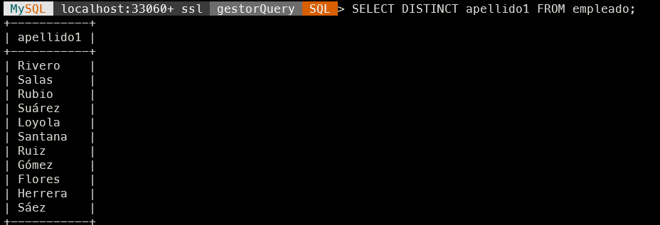

3. Lista todas las columnas de la tabla empleado.

`SELECT id,nif,nombre,apellido1,apellido2,id_departamento FROM empleado;`

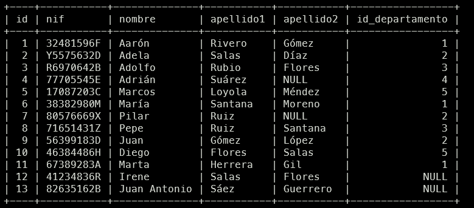

4. Lista el nombre y los apellidos de todos los empleados.

   `SELECT nombre, apellido1, COALESCE(apellido2,'') as apellido2 FROM empleado;`

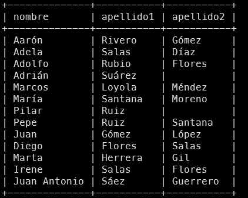

5. Lista el identificador de los departamentos de los empleados que aparecen
    en la tabla empleado.

  `SELECT id_departamento FROM empleado WHERE id_departamento IS NOT NULL;`

  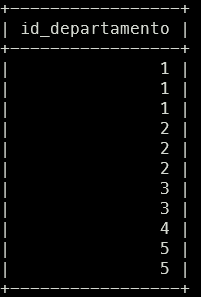

6. Lista el identificador de los departamentos de los empleados que aparecen
    en la tabla empleado, eliminando los identificadores que aparecen repetidos.
    `SELECT DISTINCT id_departamento FROM empleado WHERE id_departamento IS NOT NULL;`
    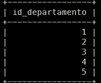

7. Lista el nombre y apellidos de los empleados en una única columna.
    `SELECT CONCAT(nombre,' ',apellido1,' ',apellido2) as Empleado FROM empleado;`
    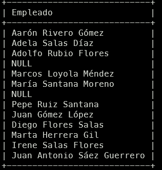
8. Lista el nombre y apellidos de los empleados en una única columna,
    convirtiendo todos los caracteres en mayúscula.
    ` SELECT UPPER(CONCAT(nombre,' ',apellido1,' ',apellido2)) as Empleado FROM empleado;`
    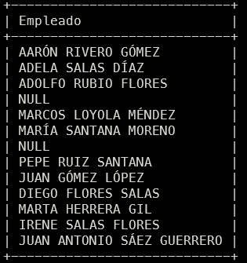
9. Lista el nombre y apellidos de los empleados en una única columna,
    convirtiendo todos los caracteres en minúscula.
    `SELECT lower(CONCAT(nombre,' ',apellido1,' ',apellido2)) as Empleado FROM empleado;`
    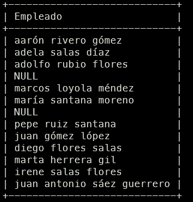
10. Lista el identificador de los empleados junto al nif, pero el nif deberá
    aparecer en dos columnas, una mostrará únicamente los dígitos del nif y la
    otra la letra.
    `SELECT REGEXP_REPLACE(nif,'[^0-9]','') as Numero,REGEXP_REPLACE(nif,'[0-9]','') AS 'LETRAS NIF' FROM empleado;`
    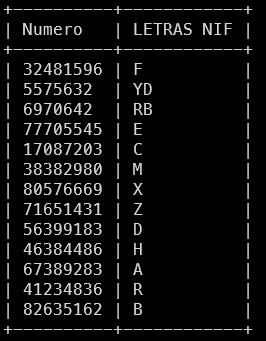

11. Lista el nombre de cada departamento y el valor del presupuesto actual del
    que dispone. Para calcular este dato tendrá que restar al valor del
    presupuesto inicial (columna presupuesto) los gastos que se han generado
    (columna gastos). Tenga en cuenta que en algunos casos pueden existir
    valores negativos. Utilice un alias apropiado para la nueva columna columna
    que está calculando.
    `SELECT nombre, presupuesto - gastos as "Presupuesto Actual" FROM departamento;`
   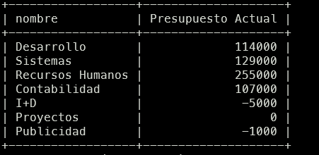
12. Lista el nombre de los departamentos y el valor del presupuesto actual
    ordenado de forma ascendente.
    `SELECT nombre, (presupuesto - gastos) AS Presupuesto_actual FROM departamento ORDER BY Presupuesto_actual ASC;`
    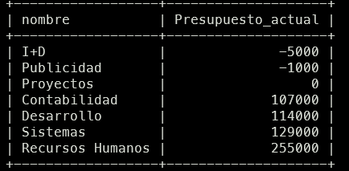

13. Lista el nombre de todos los departamentos ordenados de forma
    ascendente.
    `SELECT nombre FROM departamento ORDER By nombre;`
    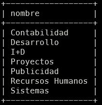
14. Lista el nombre de todos los departamentos ordenados de forma
    descendente.
    `SELECT nombre FROM departamento ORDER By nombre DESC;`
    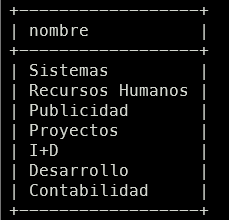

15. Lista los apellidos y el nombre de todos los empleados, ordenados de forma
    alfabética tendiendo en cuenta en primer lugar sus apellidos y luego su
    nombre.
    `SELECT apellido1,apellido2,nombre FROM empleado ORDER BY apellido1,apellido2,nombre;`
    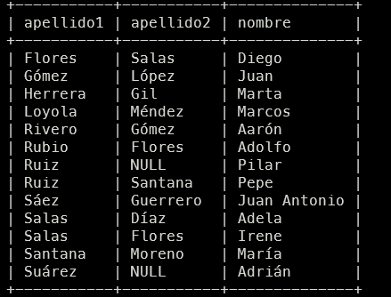
16. Devuelve una lista con el nombre y el presupuesto, de los 3 departamentos
    que tienen mayor presupuesto.
    `SELECT nombre,presupuesto FROM departamento ORDER BY presupuesto LIMIT 3`
    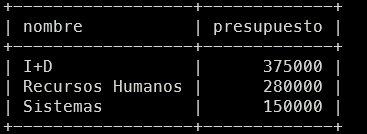
17. Devuelve una lista con el nombre y el presupuesto, de los 3 departamentos
    que tienen menor presupuesto.
    `SELECT nombre,presupuesto FROM departamento ORDER BY presupuesto LIMIT 3 ;`
    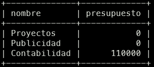

18. Devuelve una lista con el nombre y el gasto, de los 2 departamentos que
    tienen mayor gasto.
    `SELECT nombre,gastos FROM departamento ORDER BY gastos DESC LIMIT 2;`
    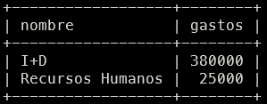
19. Devuelve una lista con el nombre y el gasto, de los 2 departamentos que
    tienen menor gasto.
    `SELECT nombre,gastos FROM departamento ORDER BY gastos ASC LIMIT 2;`
    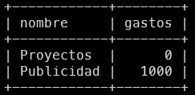
20. Devuelve una lista con 5 filas a partir de la tercera fila de la tabla empleado. La tercera fila se debe incluir en la respuesta. La respuesta debe incluir todas las columnas de la tabla empleado.
    `SELECT id,nif,nombre,apellido1,apellido2,id_departamento FROM empleado WHERE id >= 3 LIMIT 5;`
    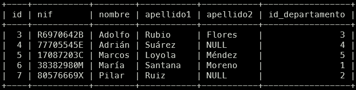

21. Devuelve una lista con el nombre de los departamentos y el presupuesto, de
    aquellos que tienen un presupuesto mayor o igual a 150000 euros.
    `SELECT nombre,presupuesto FROM departamento WHERE presupuesto >= 150000`
    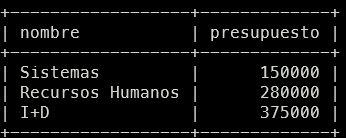
22. Devuelve una lista con el nombre de los departamentos y el gasto, de
    aquellos que tienen menos de 5000 euros de gastos.
    `SELECT nombre,gastos FROM departamento WHERE gastos < 5000;`
    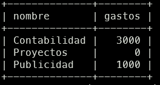
23. Devuelve una lista con el nombre de los departamentos y el presupuesto, de
    aquellos que tienen un presupuesto entre 100000 y 200000 euros. Sin
    utilizar el operador BETWEEN.
    `SELECT nombre, presupuesto FROM departamento WHERE presupuesto>=100000 AND presupuesto<=200000;`
    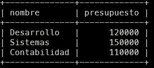
24. Devuelve una lista con el nombre de los departamentos que no tienen un
    presupuesto entre 100000 y 200000 euros. Sin utilizar el operador BETWEEN.
    `SELECT nombre, 
25. Devuelve una lista con el nombre de los departamentos que tienen un
    presupuesto entre 100000 y 200000 euros. Utilizando el operador BETWEEN.

26. Devuelve una lista con el nombre de los departamentos que no tienen un
    presupuesto entre 100000 y 200000 euros. Utilizando el operador BETWEEN.

27. Devuelve una lista con el nombre de los departamentos, gastos y
    presupuesto, de aquellos departamentos donde los gastos sean mayores
    que el presupuesto del que disponen.

28. Devuelve una lista con el nombre de los departamentos, gastos y
    presupuesto, de aquellos departamentos donde los gastos sean menores
    que el presupuesto del que disponen.

29. Devuelve una lista con el nombre de los departamentos, gastos y
    presupuesto, de aquellos departamentos donde los gastos sean iguales al
    presupuesto del que disponen.

30. Lista todos los datos de los empleados cuyo segundo apellido sea NULL.

31. Lista todos los datos de los empleados cuyo segundo apellido no sea NULL.

32. Lista todos los datos de los empleados cuyo segundo apellido sea López.

33. Lista todos los datos de los empleados cuyo segundo apellido
    sea Díaz o Moreno. Sin utilizar el operador IN.

34. Lista todos los datos de los empleados cuyo segundo apellido
    sea Díaz o Moreno. Utilizando el operador IN.

35. Lista los nombres, apellidos y nif de los empleados que trabajan en el
    departamento 3.

36. Lista los nombres, apellidos y nif de los empleados que trabajan en los
    departamentos 2, 4 o 5.