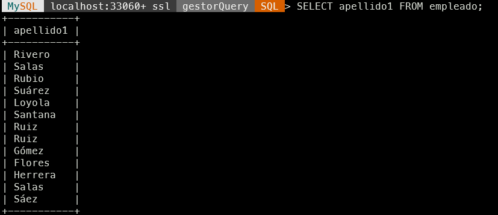
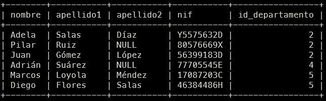
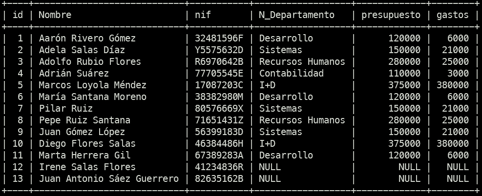
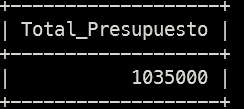
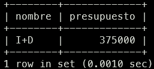

Consultas sobre una tabla
1. Lista el primer apellido de todos los empleados.

   `SELECT apellido1 FROM empleado;`

2. Lista el primer apellido de los empleados eliminando los apellidos que estén
   repetidos.

`SELECT DISTINCT apellido1 FROM empleado;`

3. Lista todas las columnas de la tabla empleado.

`SELECT id,nif,nombre,apellido1,apellido2,id_departamento FROM empleado;`

4. Lista el nombre y los apellidos de todos los empleados.

   `SELECT nombre, apellido1, COALESCE(apellido2,'') as apellido2 FROM empleado;`

5. Lista el identificador de los departamentos de los empleados que aparecen
    en la tabla empleado.

  `SELECT id_departamento FROM empleado WHERE id_departamento IS NOT NULL;`

  

6. Lista el identificador de los departamentos de los empleados que aparecen
    en la tabla empleado, eliminando los identificadores que aparecen repetidos.
    `SELECT DISTINCT id_departamento FROM empleado WHERE id_departamento IS NOT NULL;`
    

7. Lista el nombre y apellidos de los empleados en una única columna.
    `SELECT CONCAT(nombre,' ',apellido1,' ',apellido2) as Empleado FROM empleado;`
    
8. Lista el nombre y apellidos de los empleados en una única columna,
    convirtiendo todos los caracteres en mayúscula.
    ` SELECT UPPER(CONCAT(nombre,' ',apellido1,' ',apellido2)) as Empleado FROM empleado;`
    
9. Lista el nombre y apellidos de los empleados en una única columna,
    convirtiendo todos los caracteres en minúscula.
    `SELECT lower(CONCAT(nombre,' ',apellido1,' ',apellido2)) as Empleado FROM empleado;`
    
10. Lista el identificador de los empleados junto al nif, pero el nif deberá
    aparecer en dos columnas, una mostrará únicamente los dígitos del nif y la
    otra la letra.
    `SELECT REGEXP_REPLACE(nif,'[^0-9]','') as Numero,REGEXP_REPLACE(nif,'[0-9]','') AS 'LETRAS NIF' FROM empleado;`

    

11. Lista el nombre de cada departamento y el valor del presupuesto actual del
    que dispone. Para calcular este dato tendrá que restar al valor del
    presupuesto inicial (columna presupuesto) los gastos que se han generado
    (columna gastos). Tenga en cuenta que en algunos casos pueden existir
    valores negativos. Utilice un alias apropiado para la nueva columna columna
    que está calculando.
    `SELECT nombre, presupuesto - gastos as "Presupuesto Actual" FROM departamento;`

   
12. Lista el nombre de los departamentos y el valor del presupuesto actual
    ordenado de forma ascendente.
    `SELECT nombre, (presupuesto - gastos) AS Presupuesto_actual FROM departamento ORDER BY Presupuesto_actual ASC;`

    

13. Lista el nombre de todos los departamentos ordenados de forma
    ascendente.
    `SELECT nombre FROM departamento ORDER By nombre;`

    
14. Lista el nombre de todos los departamentos ordenados de forma
    descendente.
    `SELECT nombre FROM departamento ORDER By nombre DESC;`

    

15. Lista los apellidos y el nombre de todos los empleados, ordenados de forma
    alfabética tendiendo en cuenta en primer lugar sus apellidos y luego su
    nombre.
    `SELECT apellido1,apellido2,nombre FROM empleado ORDER BY apellido1,apellido2,nombre;`

    
16. Devuelve una lista con el nombre y el presupuesto, de los 3 departamentos
    que tienen mayor presupuesto.
    `SELECT nombre,presupuesto FROM departamento ORDER BY presupuesto LIMIT 3`

    
17. Devuelve una lista con el nombre y el presupuesto, de los 3 departamentos
    que tienen menor presupuesto.
    `SELECT nombre,presupuesto FROM departamento ORDER BY presupuesto LIMIT 3 ;`

    

18. Devuelve una lista con el nombre y el gasto, de los 2 departamentos que
    tienen mayor gasto.
    `SELECT nombre,gastos FROM departamento ORDER BY gastos DESC LIMIT 2;`

    
19. Devuelve una lista con el nombre y el gasto, de los 2 departamentos que
    tienen menor gasto.
    `SELECT nombre,gastos FROM departamento ORDER BY gastos ASC LIMIT 2;`

    
20. Devuelve una lista con 5 filas a partir de la tercera fila de la tabla empleado. La tercera fila se debe incluir en la respuesta. La respuesta debe incluir todas las columnas de la tabla empleado.
    `SELECT id,nif,nombre,apellido1,apellido2,id_departamento FROM empleado WHERE id >= 3 LIMIT 5;`

    

21. Devuelve una lista con el nombre de los departamentos y el presupuesto, de
    aquellos que tienen un presupuesto mayor o igual a 150000 euros.
    `SELECT nombre,presupuesto FROM departamento WHERE presupuesto >= 150000`

    
22. Devuelve una lista con el nombre de los departamentos y el gasto, de
    aquellos que tienen menos de 5000 euros de gastos.
    `SELECT nombre,gastos FROM departamento WHERE gastos < 5000;`

    
23. Devuelve una lista con el nombre de los departamentos y el presupuesto, de
    aquellos que tienen un presupuesto entre 100000 y 200000 euros. Sin
    utilizar el operador BETWEEN.
    `SELECT nombre, presupuesto FROM departamento WHERE presupuesto>=100000 AND presupuesto<=200000;`

    
24. Devuelve una lista con el nombre de los departamentos que no tienen un
    presupuesto entre 100000 y 200000 euros. Sin utilizar el operador BETWEEN.

    `SELECT nombre, presupuesto FROM departamento WHERE presupuesto<= 10000 OR presupuesto>=200000;`

    
25. Devuelve una lista con el nombre de los departamentos que tienen un
    presupuesto entre 100000 y 200000 euros. Utilizando el operador BETWEEN.

    `SELECT nombre,presupuesto FROM departamento WHERE presupuesto BETWEEN 100000 AND 200000;`

    
26. Devuelve una lista con el nombre de los departamentos que no tienen un
    presupuesto entre 100000 y 200000 euros. Utilizando el operador BETWEEN.
    `SELECT nombre,presupuesto FROM departamento WHERE presupuesto NOT BETWEEN 100000 AND 200000;`

    

27. Devuelve una lista con el nombre de los departamentos, gastos y
    presupuesto, de aquellos departamentos donde los gastos sean mayores
    que el presupuesto del que disponen.

    `SELECT nombre, gastos, presupuesto FROM departamento WHERE gastos>presupuesto;`

    

28. Devuelve una lista con el nombre de los departamentos, gastos y
    presupuesto, de aquellos departamentos donde los gastos sean menores
    que el presupuesto del que disponen.

    `SELECT nombre,gastos,presupuesto FROM departamento WHERE gastos<presupuesto;`

    

29. Devuelve una lista con el nombre de los departamentos, gastos y
    presupuesto, de aquellos departamentos donde los gastos sean iguales al
    presupuesto del que disponen.

    `SELECT nombre, gastos, presupuesto FROM departamento WHERE gastos = Presupuesto;`

    

30. Lista todos los datos de los empleados cuyo segundo apellido sea NULL.

    `SELECT id, nif, nombre, apellido1, apellido2, id_departamento FROM empleado WHERE apellido2 IS NULL;`

    

31. Lista todos los datos de los empleados cuyo segundo apellido no sea NULL.

    `SELECT id, nif, nombre, apellido1, apellido2, id_departamento FROM empleado WHERE apellido2 IS NOT NULL;`

    

32. Lista todos los datos de los empleados cuyo segundo apellido sea López.

    `SELECT id, nif, nombre, apellido1, apellido2, id_departamento FROM empleado WHERE apellido2 = 'López';`

    

33. Lista todos los datos de los empleados cuyo segundo apellido
    sea Díaz o Moreno. Sin utilizar el operador IN.

    `SELECT id, nif, nombre, apellido1, apellido2, id_departamento FROM empleado WHERE apellido2 = 'López' OR apellido2='Moreno';`

    

34. Lista todos los datos de los empleados cuyo segundo apellido
    sea Díaz o Moreno. Utilizando el operador IN.

    `SELECT id, nif, nombre, apellido1, apellido2, id_departamento FROM empleado WHERE apellido2 IN ('López');`

    
    
35. Lista los nombres, apellidos y nif de los empleados que trabajan en el
    departamento 3.

    `SELECT nombre,apellido1,apellido2, nif,id_departamento FROM empleado WHERE id_departamento = 3;`

    

36. Lista los nombres, apellidos y nif de los empleados que trabajan en los
    departamentos 2, 4 o 5.

     `SELECT nombre,apellido1,apellido2, nif,id_departamento FROM empleado WHERE id_departamento IN (2,4,5);`

     

Consultas multitabla (Composición interna)
Resuelva todas las consultas utilizando la sintaxis de SQL1 y SQL2.

1. Devuelve un listado con los empleados y los datos de los departamentos
donde trabaja cada uno.

`SELECT E.nombre,E.apellido1,D.nombre as departamento,D.presupuesto FROM empleado as E INNER JOIN departamento as D ON E.id_departamento = D.id;`

2. Devuelve un listado con los empleados y los datos de los departamentos
donde trabaja cada uno. Ordena el resultado, en primer lugar por el nombre
del departamento (en orden alfabético) y en segundo lugar por los apellidos
y el nombre de los empleados.

`SELECT D.nombre as departamento, E.nombre,E.apellido1,D.presupuesto FROM empleado as E INNER JOIN departamento as D ON E.id_departamento = D.id ORDER BY departamento,E.apellido1,E.apellido2,E.nombre;`

3. Devuelve un listado con el identificador y el nombre del departamento,
solamente de aquellos departamentos que tienen empleados.

`SELECT DISTINCT D.id, D.nombre FROM departamento AS D INNER JOIN empleado AS E ON D.id = E.id_departamento;`

4. Devuelve un listado con el identificador, el nombre del departamento y el
valor del presupuesto actual del que dispone, solamente de aquellos
departamentos que tienen empleados. El valor del presupuesto actual lo
puede calcular restando al valor del presupuesto inicial
(columna presupuesto) el valor de los gastos que ha generado
(columna gastos).

`SELECT DISTINCT D.id, D.nombre,(D.presupuesto - D.gastos) FROM departamento AS D INNER JOIN empleado AS E ON D.id = E.id_departamento;`

5. Devuelve el nombre del departamento donde trabaja el empleado que tiene
el nif 38382980M.

`SELECT  D.nombre as Departamento ,E.nombre AS Nombre_Empleado  FROM departamento AS D INNER JOIN empleado AS E ON D.id = E.id_departamento WHERE E.nif='38382980M';`

6. Devuelve el nombre del departamento donde trabaja el empleado Pepe Ruiz
Santana.

`SELECT  D.nombre as Departamento ,E.nombre AS Nombre_Empleado  FROM departamento AS D INNER JOIN empleado AS E ON D.id = E.id_departamento WHERE E.nombre='Pepe';`

7. Devuelve un listado con los datos de los empleados que trabajan en el
departamento de I+D. Ordena el resultado alfabéticamente.

`SELECT E.id, CONCAT_WS(' ',E.nombre,E.apellido1,E.apellido2) as Nombre, E.nif FROM empleado as E LEFT JOIN departamento as D ON E.id_departamento = D.id;`

8. Devuelve un listado con los datos de los empleados que trabajan en el
departamento de Sistemas, Contabilidad o I+D. Ordena el resultado
alfabéticamente.

`SELECT E.id, CONCAT_WS(' ',E.nombre,E.apellido1,E.apellido2) as Nombre, E.nif FROM empleado as E LEFT JOIN departamento as D ON E.id_departamento = D.id WHERE D.nombre IN ('Sistemas','Contabilidad','I+D') ORDER BY nombre;`

9. Devuelve una lista con el nombre de los empleados que tienen los
departamentos que no tienen un presupuesto entre 100000 y 200000 euros.

`SELECT E.id, CONCAT_WS(' ',E.nombre,E.apellido1,E.apellido2) as Nombre, E.nif FROM empleado as E LEFT JOIN departamento as D ON E.id_departamento = D.id WHERE D.presupuesto < 100000 OR D.Presupuesto > 200000;`

10. Devuelve un listado con el nombre de los departamentos donde existe
algún empleado cuyo segundo apellido sea NULL. Tenga en cuenta que no
debe mostrar nombres de departamentos que estén repetidos.

`SELECT D.id,D.nombre FROM departamento AS D INNER JOIN empleado as E ON D.id=E.id_departamento WHERE E.apellido2 IS NULL;`

Consultas multitabla (Composición externa)
Resuelva todas las consultas utilizando las cláusulas LEFT JOIN y RIGHT JOIN.
1. Devuelve un listado con todos los empleados junto con los datos de los
departamentos donde trabajan. Este listado también debe incluir los
empleados que no tienen ningún departamento asociado.

`SELECT E.id, CONCAT_WS(' ',E.nombre,E.apellido1,E.apellido2) as Nombre, E.nif,D.nombre N_Departamento,D.presupuesto,D.gastos FROM empleado as E LEFT JOIN departamento as D ON E.id_departamento = D.id;`

2. Devuelve un listado donde sólo aparezcan aquellos empleados que no
tienen ningún departamento asociado.

`SELECT E.id, CONCAT_WS(' ',E.nombre,E.apellido1,E.apellido2) as Nombre, E.nif,D.nombre as N_Departamento,D.presupuesto,D.gastos FROM empleado as E LEFT JOIN departamento as D ON E.id_departamento = D.id WHERE E.id_departamento IS NULL;`

3. Devuelve un listado donde sólo aparezcan aquellos departamentos que no
tienen ningún empleado asociado.

`SELECT D.nombre as N_Departamento,D.presupuesto,D.gastos FROM empleado as E RIGHT JOIN departamento as D ON E.id_departamento = D.id WHERE E.id_departamento IS NULL;`

4. Devuelve un listado con todos los empleados junto con los datos de los
departamentos donde trabajan. El listado debe incluir los empleados que no
tienen ningún departamento asociado y los departamentos que no tienen
ningún empleado asociado. Ordene el listado alfabéticamente por el
nombre del departamento.

`SELECT T.NombreEm, T.nif,T.nombre as N_Departamento,T.presupuesto,T.gastos FROM (SELECT E.id, CONCAT_WS(' ',E.nombre,E.apellido1,E.apellido2) as NombreEm, E.nif, D.nombre,D.Presupuesto,D.gastos FROM empleado as E LEFT JOIN departamento as D ON E.id_departamento = D.id ORDER BY D.nombre) AS T UNION ALL (SELECT NULL,NUll,departamento.nombre as N_Departamento,departamento.presupuesto,departamento.gastos FROM departamento LEFT JOIN empleado ON empleado.id_departamento = departamento.id WHERE empleado.id_departamento IS NUll ORDER BY departamento.nombre)ORDER BY N_Departamento;`

5. Devuelve un listado con los empleados que no tienen ningún departamento
asociado y los departamentos que no tienen ningún empleado asociado.
Ordene el listado alfabéticamente por el nombre del departamento.

`SELECT E.id, CONCAT_WS(' ',E.nombre,E.apellido1,E.apellido2) as NombreEm, E.id_departamento as N_Departamento, NUll as nombre
FROM empleado as E 
LEFT JOIN departamento AS D ON E.id_departamento = D.id 
WHERE E.id_departamento IS NULL
UNION ALL
SELECT NULL AS id, NULL as NombreEm, D.id as N_Departamento, D.nombre 
FROM departamento AS D 
LEFT JOIN empleado as E ON D.id = E.id_departamento 
WHERE E.id_departamento IS NULL ORDER BY N_Departamento;`

Consultas resumen
1. Calcula la suma del presupuesto de todos los departamentos.

    `SELECT sum(presupuesto) AS Total_Presupuesto FROM departamento;`

    

2. Calcula la media del presupuesto de todos los departamentos.

`SELECT ROUND(AVG(presupuesto),2) AS AVG_Presupuesto FROM departamento;`

3. Calcula el valor mínimo del presupuesto de todos los departamentos.

`SELECT nombre,presupuesto AS Menor_Presupuesto 
FROM departamento 
WHERE presupuesto = (SELECT MIN(presupuesto) FROM departamento);
`

4. Calcula el nombre del departamento y el presupuesto que tiene asignado,
del departamento con menor presupuesto.

`SELECT nombre,presupuesto AS Menor_Presupuesto  
FROM departamento  
WHERE presupuesto = (SELECT MIN(presupuesto) FROM departamento);  `

5. Calcula el valor máximo del presupuesto de todos los departamentos.

`SELECT MAX(presupuesto) FROM departamento;`

6. Calcula el nombre del departamento y el presupuesto que tiene asignado,
del departamento con mayor presupuesto.

`SELECT nombre,presupuesto AS Mayor_Presupuesto 
FROM departamento 
WHERE presupuesto = (SELECT MAX(presupuesto) FROM departamento);
`

7. Calcula el número total de empleados que hay en la tabla empleado.

`SELECT count(id) FROM empleado;`

8. Calcula el número de empleados que no tienen NULL en su segundo
apellido.

`SELECT count(id) as NULL_Apellido2 FROM empleado WHERE apellido2 is NULL;`

9. Calcula el número de empleados que hay en cada departamento. Tienes que
devolver dos columnas, una con el nombre del departamento y otra con el
número de empleados que tiene asignados.

`SELECT D.nombre, count(E.id_departamento) FROM departamento D INNER JOIN empleado E ON D.id = E.id_departamento GROUP BY E.id_departamento;`

10. Calcula el nombre de los departamentos que tienen más de 2 empleados. El
resultado debe tener dos columnas, una con el nombre del departamento y
otra con el número de empleados que tiene asignados.

`SELECT D.nombre, count(E.id_departamento) as PersonasByDep FROM departamento D INNER JOIN empleado E ON D.id = E.id_departamento GROUP BY E.id_departamento HAVING PersonasByDep > 2;`

11. Calcula el número de empleados que trabajan en cada uno de los
departamentos. El resultado de esta consulta también tiene que incluir
aquellos departamentos que no tienen ningún empleado asociado.

`SELECT D.nombre, count(E.id_departamento) FROM departamento D LEFT JOIN empleado E ON D.id = E.id_departamento GROUP BY D.nombre;`

12. Calcula el número de empleados que trabajan en cada unos de los
departamentos que tienen un presupuesto mayor a 200000 euros.

`SELECT D.nombre, count(E.id_departamento),D.presupuesto FROM departamento D INNER JOIN empleado E ON D.id = E.id_departamento WHERE presupuesto > 200000 GROUP BY E.id_departamento;`

Subconsultas
Con operadores básicos de comparación
1. Devuelve un listado con todos los empleados que tiene el departamento
de Sistemas. (Sin utilizar INNER JOIN).
`SELECT CONCAT_WS(' ', E.nombre,E.apellido1,E.apellido2) as NombreEmp FROM empleado E WHERE id_departamento = (SELECT D.id FROM departamento D WHERE D.nombre = 'Sistemas');`

2. Devuelve el nombre del departamento con mayor presupuesto y la cantidad
que tiene asignada.

`SELECT nombre, presupuesto FROM departamento ORDER BY presupuesto DESC LIMIT 1;`

3. Devuelve el nombre del departamento con menor presupuesto y la cantidad
que tiene asignada.

`SELECT nombre, presupuesto FROM departamento ORDER BY presupuesto ASC LIMIT 1;`

Subconsultas con ALL y ANY
4. Devuelve el nombre del departamento con mayor presupuesto y la cantidad
que tiene asignada. Sin hacer uso de MAX, ORDER BY ni LIMIT.

`SELECT nombre, presupuesto FROM departamento WHERE presupuesto >= ALL(SELECT presupuesto FROM departamento);`

5. Devuelve el nombre del departamento con menor presupuesto y la cantidad
que tiene asignada. Sin hacer uso de MIN, ORDER BY ni LIMIT.

`SELECT nombre, presupuesto FROM departamento WHERE presupuesto <= ALL(SELECT presupuesto FROM departamento);`

6. Devuelve los nombres de los departamentos que tienen empleados
asociados. (Utilizando ALL o ANY).

`SELECT CONCAT_WS(' ', E.nombre,E.apellido1,E.apellido2) NombreEmp  ,E.id_departamento FROM empleado E WHERE E.id_departamento = ANY (SELECT id FROM departamento);`

7. Devuelve los nombres de los departamentos que no tienen empleados
asociados. (Utilizando ALL o ANY).

`SELECT D.id,D.nombre FROM departamento D WHERE NOT D.id = ANY (SELECT E.id_departamento FROM empleado E WHERE E.id_departamento IS NOT NUll);`

`SELECT D.id,D.nombre FROM departamento D WHERE NOT D.id = ANY (SELECT E.id_departamento FROM empleado E WHERE E.id_departamento IS NOT NUll);`

Subconsultas con IN y NOT IN
8. Devuelve los nombres de los departamentos que tienen empleados
asociados. (Utilizando IN o NOT IN).

`SELECT D.id,D.nombre FROM departamento D WHERE D.id IN (SELECT E.id_departamento FROM empleado E WHERE E.id_departamento IS NOT NULL);`

9. Devuelve los nombres de los departamentos que no tienen empleados
asociados. (Utilizando IN o NOT IN).

SELECT D.id,D.nombre FROM departamento D WHERE D.id NOT IN (SELECT E.id_departamento FROM empleado E WHERE E.id_departamento IS  not NULL);

Subconsultas con EXISTS y NOT EXISTS
10. Devuelve los nombres de los departamentos que tienen empleados
asociados. (Utilizando EXISTS o NOT EXISTS).

`SELECT D.id,D.nombre FROM departamento D WHERE EXISTS(SELECT 1 FROM empleado E WHERE E.id_departamento = D.id);`

11. Devuelve los nombres de los departamentos que tienen empleados
asociados. (Utilizando EXISTS o NOT EXISTS).

`SELECT D.id,D.nombre FROM departamento D WHERE NOT EXISTS(SELECT 1 FROM empleado E WHERE E.id_departamento = D.id);`

